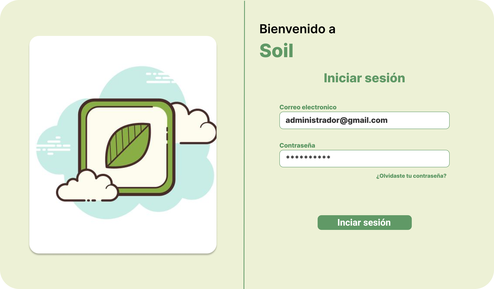

# Soil-Collaborative

Para mi Poryecto final En la materia Electiva I el reto fue crear y documentar una aplicacion para la gestion del Cultivo de Cacao en una zona  Rural de Nariño-Colombia con un equipo de trabajo de cuatro personas, 
esta apliacion fue desarrollada con Django y React durante 6 meses y anexada a nuestros portafolios personales de ahi libre su vizualizacion en este repositorio.

El software Soil, es un sistema de información que cumple con la función de registrar datos de diferentes productores que trabajan con el cultivo de cacao, dando a conocer las características que posee cada uno de sus predios.

