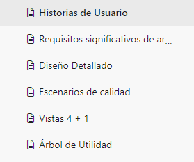
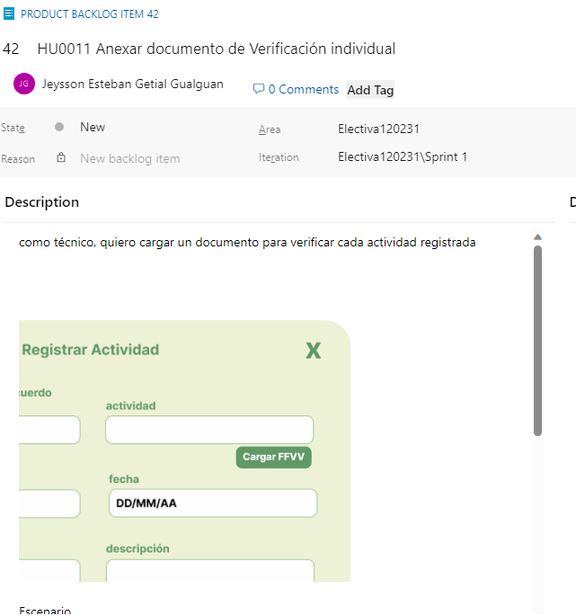
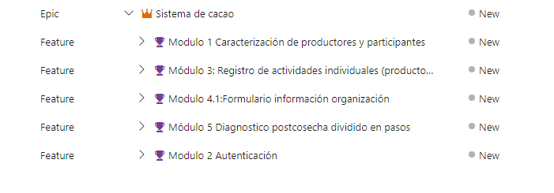
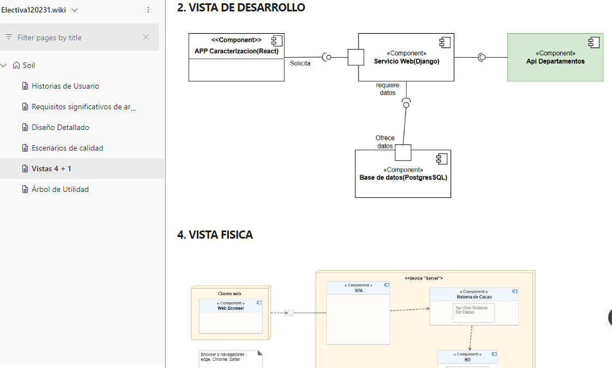

# Soil-Collaborative

Para mi Poryecto final En la materia Electiva I el reto fue crear y documentar una aplicacion para la gestion del Cultivo de Cacao en una zona  Rural de Nariño-Colombia con un equipo de trabajo de cuatro personas, 
esta apliacion fue desarrollada con Django y React durante 6 meses y anexada a nuestros portafolios personales de ahi libre su vizualizacion en este repositorio.

El software Soil, es un sistema de información que cumple con la función de registrar datos de diferentes productores que trabajan con el cultivo de cacao, dando a conocer las características que posee cada uno de sus predios.

# Install

El proyecto se encuentra en dos Ramas de git para que descargues y pruebes si te intereza el ejemplo
!!!!ADVERTENCIA!! se recuerda que el uso de este proyecto esta prohibido ya que es de caracter educativo

## Desarrollo

Nuestra metodología de desarrollo se basó en Scrum, y con ello, documentar el proceso de construccion.

## Aportes Personales

Por su extensidad mostrare algunos aportes realizados en el caso de levanteamiento de Requisitos una historia de Usuario con su respectiva maqueta

Se modularizo los componentes para mejorar el rendimiento del equipo

se aplico 4+1 para constuir y diseñar Soil

# Creditos al Equipo

se recalca que este fue un proyecto colaborativo y de caracter academico siendo anexado a este repositorio por participacion directa del mismo agradecimiento al equipo de Desarrollo y doscente 
@JuanCampino,@DanielVillota,@SantiagoMoreno,@EstebanGetial 

DATOS EXTRAIDOS DE 
https://dev.azure.com/desarrollowebuccpasto/
